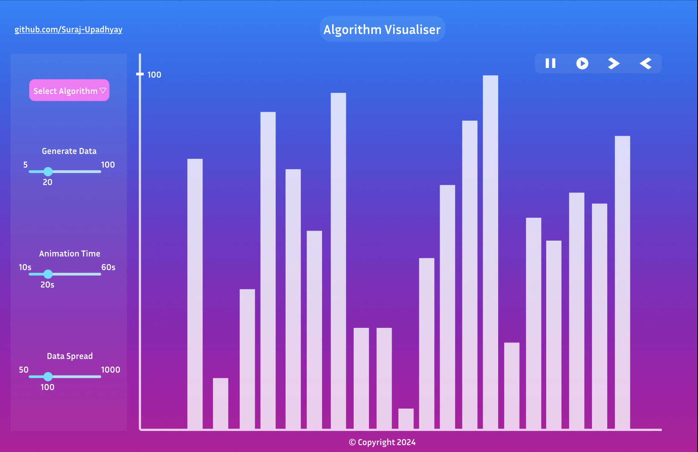

# Algorithm Visualiser

This project aims to create a scalable web application that shows the internals and inner workings of Algorithms and the data they operate upon. Along with giving insights into the efficiency and speed of various algorithms given different input data and scenarios.

Here's a snpashot of the project:

And here's the link to the deployed website: [Algorithm Visualiser](https://suraj-upadhyay.github.io/Algorithm-Visualiser/)

## Objective

I have great ideas and vision for this project to become a single source for learning the ins and outs of Algorithms and Data Structures. The project aims to provide visual help for learners to understand Algorithms and the Data Structures they use.

## Contributors

This project is an open source endeavour to bring front-end problem solvers and open source contributors to try their hands on a rather simple and client facing application with no overload of managing backed code. And it is well suited for contributors that are First Time Contributors and are just starting their journey in Open Source, or are starting with web development and ReactJS, or are here just for the fun of understanding and implementing new algorithms while integrating them into the project.

People who want to contribute to this project are welcome to use the discusssion board to contact me and suggest new ideas or obtain information about the project.

***Do read [CONTRIBUTING.md](./CONTRIBUTING.md) before submitting any PRs or working on one.***

#### Happy Coding 🚀
